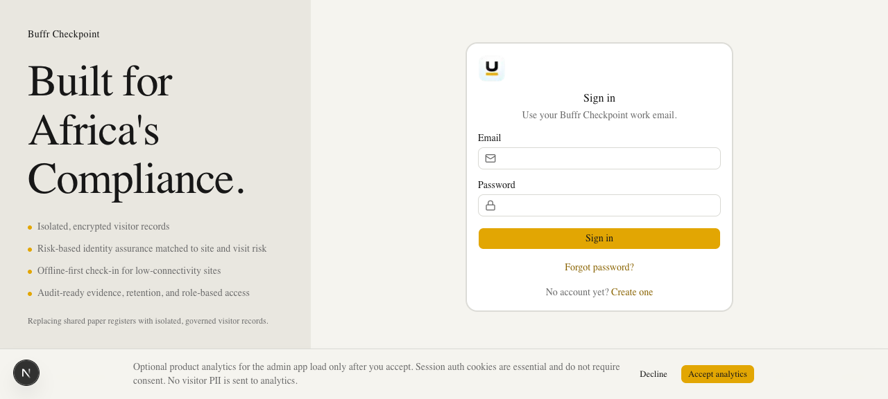

# Buffr Checkpoint Admin

Customer-tenant admin for Buffr Checkpoint — visitor check-in, front-desk roster,
compliance evidence, site experience, and RBAC. Built with Next.js 16, React 19,
TypeScript, Tailwind CSS v4, and shadcn/ui.



## App routes (product)

| Route | Purpose |
|---|---|
| `/dashboard/overview` | Operational home — on-site metrics, visit activity, roster preview |
| `/dashboard/front-desk` | Live on-site roster and visit ops |
| `/dashboard/visitors` | Historical visitor search |
| `/dashboard/policies/forms` | Visitor types and form builder |
| `/dashboard/account` | Authenticated operator account (not `/dashboard/profile`) |

Post-login and logo home resolve to `/dashboard/overview`. Legacy
`/dashboard/default` redirects there.

## Local development

```bash
cp .env.example .env.local
# BACKEND_API_URL=http://localhost:3001
npm install
npm run dev
```

Admin defaults to port 3000. The Nest API must be running on 3001 (see
`../backend`).

## Scripts

| Command | Description |
|---|---|
| `npm run dev` | Start Next.js |
| `npm run build` | Production build |
| `npm run check` | Biome lint/format check |
| `npm test` | Vitest |

## Notes

- Light theme only (Buffr Checkpoint preset). Theme switcher removed.
- No Studio Admin / template demo verticals (CRM, finance, fake users).
- Artifact downloads and form AI assist call the Nest backend; see
  `../backend/.env.example` for `ARTIFACT_STORE` and `FORM_AI_*`.
